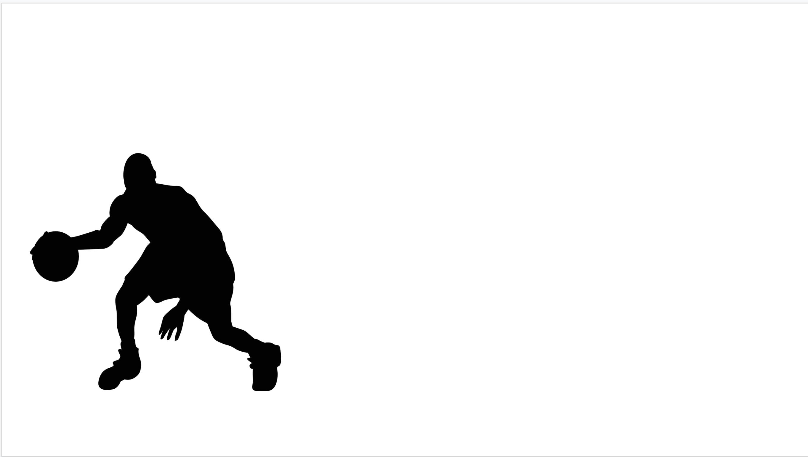

This guide assumes you have already created an auth object using the auth quickstart.

It will walk you through a more complicated slides example, which demonstrates
how you can easily create complex presentations that would be frustrating
to do manually.

In particular, we're not going to use any templates here - while templates are powerful,
sometimes you just need a blank canvas.

We'll be creating a deck that will highlight how some
players from the US National Basketball Association perform in key metrics, in
particular based on their height. Basketball is a team sport that involves
shooting a ball into an elevated hoop - height is often perceived to be
strongly correlated with player performance. If you don't know anything about it,
don't worry!

This presentation will use content from the following resources:

- Kaggle
- NBA Images

## Get Our Deck

Humans work with names, not IDs. The `get_safe` method will fetch an existing presentation if
it exists, or create it if it does not.

We're also going to import a few classes that will be useful down the road.

We'll cover each of these in more detail later.

```python
from pygsuite import Presentation
from pygsuite.slides import ShapeType, ElementProperties, LineConnection, AnchorPosition


title = "NBA Jam"
prez = Presentation.get_safe(title)

```

### Add Some Base Data

We need to get some base data. We're going to take a brief detour to sheets here.

Head over to [Kaggle](https://www.kaggle.com/justinas/nba-players-data) to grab it.

On this page, click the 'export to google slides' option. That'll appear as a
spreadsheet like icon over the tabular dataset.

Once you've got the data, copy the URL. We'll use this to create a sheets object,
which will be the temporary source of our data. We can just index
the first worksheet and grab all rows as a dataframe.

Print the first 10 rows to examine the data.

```python
data_sheet = Spreadsheet(id='https://docs.google.com/spreadsheets/d/1wHdz5fSkVIfeu7U1T9Grmoj3ppOs5i7IPH06Yyp5D7I/edit#gid=1032859992')

data = data_sheet[0].dataframe

print(data.head(10))

```

Now, let's filter to a specific season. We'll use this dataframe for the rest of our work

```python
data2018 = data[data.season == '2018-19']

print(data2018.head(10))
```

### Extract some Insight

We want to start to visualize some of these players.

Let's find our tallest and shortest.

We can sort our dataframe by the 'playerheight' column, and find our
tallest and shortest players.

```python
sorted2018 = data2018.sort_values('player_height')
max_min = sorted2018.iloc[[0, -1]]
print(max_min.head())

```
You should see something like this:


### Add Content

We should have some nice contrasts here between our shortest and tallest player.

Let's compare them.

We want to visualize how big this relative difference is, in our slide.

We can do this by grabbing a generic player silhouette and appropriately sizing it.

First we need to define some constants.

We need a public URL for our silhouette image - let's use 'http://clipart-library.com/images_k/silhouette-of-basketball-player/silhouette-of-basketball-player-10.png.

It's useful to know the ratio of this image for other operations to avoid hard-coding.

From inspecting the image size, it looks like we can`1024 / 891` as the ratio.

The height value is in CMs. Let's assume 250cms, or 2.5 meters is a reasonable human
height to anchor on.

We also have our target height for the slide - let's say 350 Pts. This will take up most of the
horizontal space on a slide.

It's also a bad idea to be too close to the borders of a slide. Let's define some padding of
25 pts.

Let's define these as globals:

```python
SILHOUETTE_URL = 'http://clipart-library.com/images_k/silhouette-of-basketball-player/silhouette-of-basketball-player-10.png'

SILHOUETTE_HEIGHT_WIDTH_RATIO = 1024 / 891

HUMAN_CM_SCALE = 250

SILHOUETTE_MAX_HEIGHT = 360

EDGE_PADDING = 25

```

Now we can scale each players height against the human baseline, then against our target height
to convert the height to PTs on a slide.

Let's define a function to scale each player appropriately and add them to the slide
that uses those constants.

Given a slide, we can simply call 'add_image' with the URL and properties for where we want to insert it.

When adding an image, the default x, y positioning is for the top left of the image.

Since we want at least the padding away from the left side, our X will be our padding. Y is
indexed from the top of the slide, so we'll take our total slide height, subtract padding, then
subtract our height again. We can access the total slide height [default] through a property of the
slide ElementPropreties class.

The height and width of our image will just be the target height and width.

```python
def add_player_image(slide, row):
    target_height = SILHOUETTE_MAX_HEIGHT * float(row.player_height) / HUMAN_CM_SCALE
    target_width =  target_height * SILHOUETTE_HEIGHT_WIDTH_RATIO
    y = ElementProperties.base_height - EDGE_PADDING - target_height
    slide.add_image(SILHOUETTE_URL,
                    ElementProperties(x=EDGE_PADDING, 
                                      y=y,
                                      height=target_height, 
                                      width=target_width))
```

### But First, a Slide

But to use this function, we need a slide.

Let's add one quickly, then insert our first player.

We want to immediately work on this slide; this is easiest if we flush the addition
to get the slide ID as soon as we create it, and then pass that reference
directly into our new function.

Grab the slide, call the function, and flush the presentation.

```python
slide = prez.add_slide(flush=True)
add_player_image(slide, max_min.iloc[0] )
prez.flush()
```

Take a look at the slide. You should see something that looks like this:




Let's do that again, with our other player. We'll call the same function and
swap to passing in our second row.

```python
slide = prez.add_slide(flush=True)
add_player_image(slide, max_min.iloc[1] )
prez.flush()
```

Swap between the two and see the size change. 

Wouldn't it be nice if we could see them side by side?

### Comparing

Let's edit our functions to do exactly that.

We need to be able to change the x-offset of our images.

For a side to side comparison, let's place our second image halfway across the slide,
plus the standard offset. To enable this, let's allow adding an x-offset to our function.

```python
def add_player_image(slide, row, x_offset=0):
    target_height = SILHOUETTE_MAX_HEIGHT * float(row.player_height) / HUMAN_CM_SCALE
    target_width =  target_height * SILHOUETTE_HEIGHT_WIDTH_RATIO
    y = ElementProperties.base_height - EDGE_PADDING - target_height
    x = x_offset+EDGE_PADDING
    slide.add_image(
        SILHOUETTE_URL,
        ElementProperties(x=x,
                          y=y,
                          height=target_height, 
                          width=target_width))

```

Now we can simply loop over both players on one slide, using the ElementProperties base_width property.

```python
slide = prez.add_slide(flush=True)
for idx in [0, 1]:
    x_offset = 0 + ElementProperties.base_width * .5 * idx
    add_player_image(slide, max_min.iloc[idx], x_offset=x_offset)
prez.flush()

```

Great! Now how can we make this height difference more clear to someone looking at this?

Maybe we throw in a height marker and label it. Let's updated our function:

We'll move our base X value up to a constant, since we'll reference it a few times.

Now let's add a straight line going up the height of the player, with a text box labeling it
in centimeters.

```python
def add_player_image(slide, row, x_offset=0):
    base_x = x_offset + EDGE_PADDING
    target_height = SILHOUETTE_MAX_HEIGHT * float(row.player_height) / HUMAN_CM_SCALE
    target_width = target_height * SILHOUETTE_HEIGHT_WIDTH_RATIO
    x = x_offset + EDGE_PADDING
    y = ElementProperties.base_height - EDGE_PADDING - target_height
    slide.add_image(SILHOUETTE_URL,
                    ElementProperties(x=x, 
                                    y=y,
                                    height=target_height, 
                                    width=target_width)
    )
    
    line_y = ElementProperties.base_height - EDGE_PADDING - target_height
    slide.add_line('STRAIGHT', 
                    ElementProperties(x=base_x   - 15,
                    y=y,
                    height=target_height, 
                    width=1))
    shape = slide.add_shape(ShapeType.TEXT_BOX,
                            ElementProperties(x=base_x   - 10,
                                              y=ElementProperties.base_height - EDGE_PADDING - target_height,
                                              height=20, width=69))
    shape.text = f'{row.player_height} cm'
    shape = slide.add_shape(ShapeType.TEXT_BOX,
                                ElementProperties(x=base_x   - 10,
                                                  y=ElementProperties.base_height - EDGE_PADDING - target_height -20,
                                                  height=20, width=180))
    shape.text = f'{row.player_name}'


```

We can then simply loop over our players, passing in half the page as the start index,
and generate a nice side by side comparison.

```python
slide = prez.add_slide(flush=True)
for idx in [0, 1]:
    x_offset = 0 + ElementProperties.base_width * .5 * idx
    add_player_image(slide, max_min.iloc[idx], x_offset=x_offset)
prez.flush()

```

Your output slide should look like this:


It's a decent start, but we've got a lot more data we could display.

We also need some color.

### Next Steps

Coming soon.
